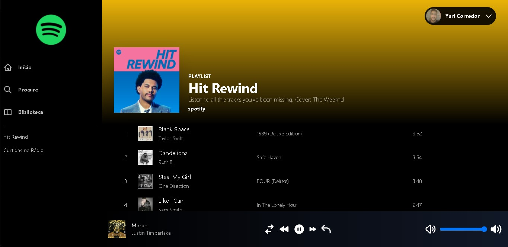
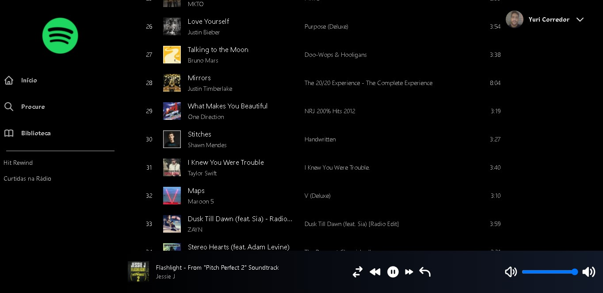
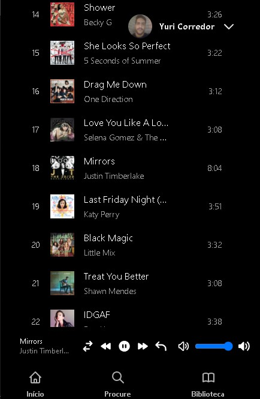

<h1>Spotify Clone</h1>

<p>The spotify API is a type of "remote controller", which means that this app only works if the user has the Spotify app opened. Their API allows us to control the device that is currently playing the song. The APP does not have the abillity to play the songs by itself.</p>

<h2>Techonologies used</h2>
<ul>
    <li>Next.js</li>
    <li>NextAuth.js</li>
    <li>Tailwind</li>
    <li>Spotify Api</li>
    <li>
        <a href='https://github.com/thelinmichael/spotify-web-api-node' target='_blank'>Spotify Web API Node</a>
    </li>
    <li>Recoil for state managment</li>
</ul>

<br>
<br>

<h1>Getting started</h1>

This project uses the Spotify API, therefore, you'll need to get an API KEY clicking [here](https://developer.spotify.com/documentation/web-api/quick-start/) and following the structions on their website.


```bash
git clone https://github.com/YuriCorredor/front-end-challenge.git
cd spotify-clone
# install dependencies
npm install
# or 
yarn install
```

<p>Before running the server, it is necessary to enter the Spotify's API key in the .env file, otherwise the app will not work as it should.</p>


```bash
# In the .env, change the fields "NEXT_PUBLIC_CLIENT_SECRET" and "NEXT_PUBLIC_CLIENT_ID" with your info

NEXTAUTH_URL=http://localhost:3000
NEXT_PUBLIC_CLIENT_SECRET=CLIENT_SECRET_FROM_SPOTIFY
NEXT_PUBLIC_CLIENT_ID=CLIENT_ID_FROM_SPOTIFY
JWT_SECRET=SUPER_RANDOM_SECRET_VERY_SECURE_INDEED
```

<p>Just run it now.</p>

```bash
npm run dev
# or
yarn dev
```

<br>
<br>

<h1>Overview of the app</h1>

Live website [HERE](https://spotify-clone-yuri-corredor.vercel.app/).

Desktop                    |  Mobile
:-------------------------:|:-------------------------:
              |  
              |  
